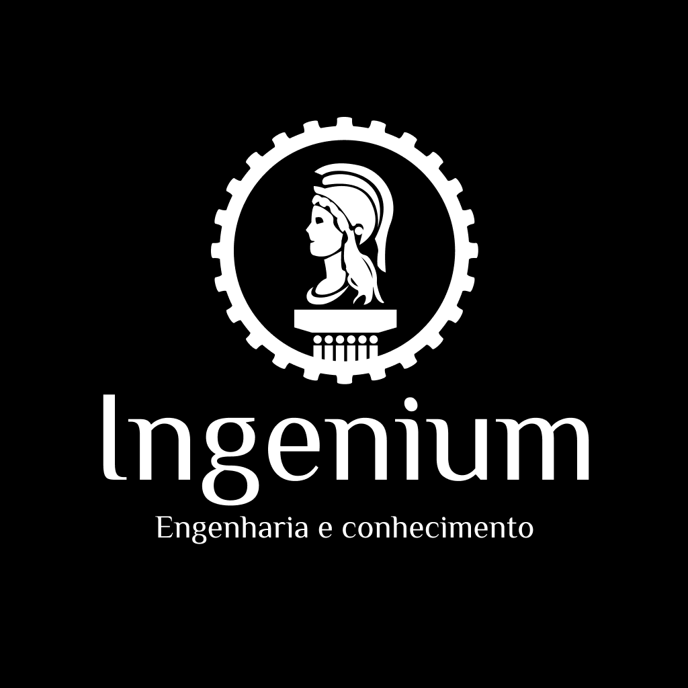

<h1 align="center">
  
</h1>

<h4 align="center"> 
	🖥️ projetoingenium.github.io
</h4>

  
  

## Ingenium

Nosso objetivo é divulgar a atuação da área de Engenharia, reforçando sua importância, ajudando na capacitação de novos profissionais e proporcionando conteúdos para toda a comunidade.

## Projeto - projetoingenium.github.io

A ideia desse site é manter um site que possa destacar algumas informações extras sobre o projeto, como os orientadores e colaboradores que atuaram em cada semestre, bem como outras anotações pertinentes.

## Tecnologias

O projeto utiliza as seguintes tecnologias:
- [Javascript](https://www.javascript.com/)
- [React](https://pt-br.reactjs.org/)
